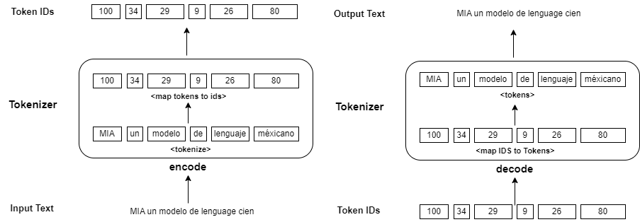
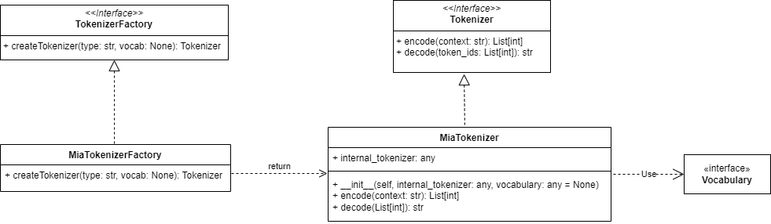

# MIA Tokenizer experiment

A small architecture designed to experiment with different tokenizers implementations. This is
the code provided as part of my post - [Pre-procesamiento de datos en el Modelo de Lenguaje MIA](https://edwinmoo.substack.com/p/embeddings-en-el-modelo-de-lenguaje?r=233vmr).

## MIA Tokenizer experiment details

The design objective of this architecture implementation is to allow us to experiment with several robust implementations of tokenizers only providing the name of it and a sample text from command line.

Supported tokenizer implementations are as follow:

- Mia Simple Tokenizer ('mia_basic') - A simple tokenizer implemented from scratch using a small corpus
embedding in the data folder of this project.
- Tiktoken ('tiktoken_xxxx') - OpenAI's implementation of robust tokenizers being used in its different models. You can experiment replacing the model name (gpt2, gpt3, gtp4o) or any other model from OpenAI.

It's important to note that this architecture was only for experimentation purpose of several tokenizers implemented by third party big companies, final design for tokenizer specfici for MIA model takes into consideration other aspects that are more related with MIA model, anyway we also provide the basic mia tokenizer that implements a simple algorithm from scratch.

### Tokenizers experimentation diagrams




## Project Structure

```
.
├── README.md
├── requirements.txt
├── main.py
├── configs
├── data
├── docs
├── tokenizer
│   └── miatokenizer.py
├── utils
```

- **tokenizer/miatokenizer.py** - Module that defines all classes for tokenizer implementation based on the class diagram above.
- **main.py** - Entry point to run experiments with different tokenizers.

## How to run and test a tokenizer implementation

```
Run below commands if you environment is linux otherwise replace step 2 with this instruction 
'.\miatokvenv\Scripts\activate.bat'

1.- python -m venv miatokvenv
2.- source ./miatokvenv/bin/activate
3.- pip install -r requirements.txt
4.- python main.py --tokenizer_name mia_simple --sample_text "Replace with your own text"

```

In case you want to run a test using another tokenizer only provide the name of one of the supported in this implementation as described in above seccions.

